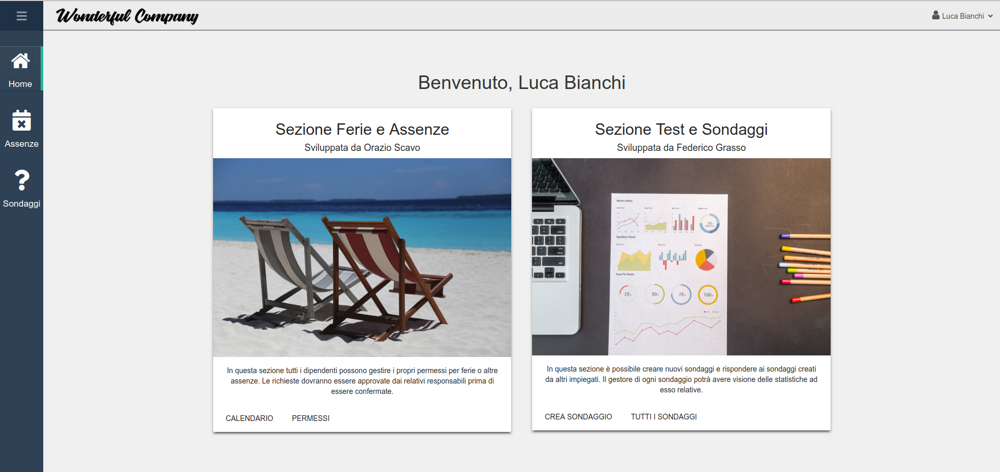
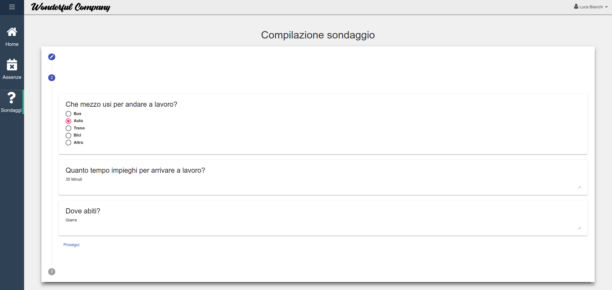
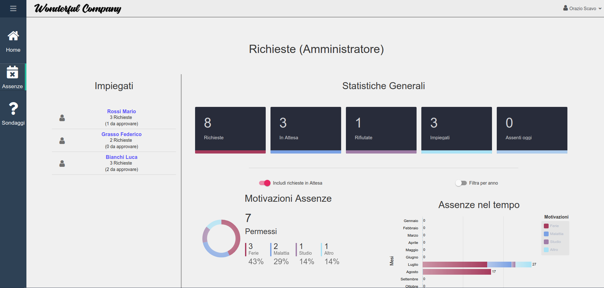

# WonderfulCompany

## Table of Contents

- [References](#references)
- [Screenshots](#screenshots)
- [Requirements](#requirements)
- [Running](#running)

## References

Full Documentation is available <a href="https://orazioscavo13.github.io/wonderfulcompany/">here</a>
<br/>
Take a look to the <a href="http://159.65.207.157/">demo</a>

## Screenshots







## Requirements

- `nodejs` (>=10.x)
- `npm` or `yarn`

run

```bash
npm install -g @angular/cli
```

## Principal Technologies used

- `nodejs`
- `express`
- `angular`
- `mySQL`
- `Angular Material`
- `bootstrap`
- `Angular Flex`
- `ngx-charts`
- `angular6-calendar`

## Running for Test

#### First time

```bash
git clone https://github.com/orazioscavo13/wonderfulcompany.git
cd wonderfulcompany
yarn install
ng serve
```

#### Later on

```bash
cd wonderfulcompany
ng serve
```

## Building

#### First time

```bash
git clone https://github.com/orazioscavo13/wonderfulcompany.git
cd wonderfulcompany
yarn install
ng build
```

#### Later on

```bash
cd wonderfulcompany
ng build
```

## Admin Credentials

- Email: `admin@wonderfulcompany.it`
- Password: `angular`
